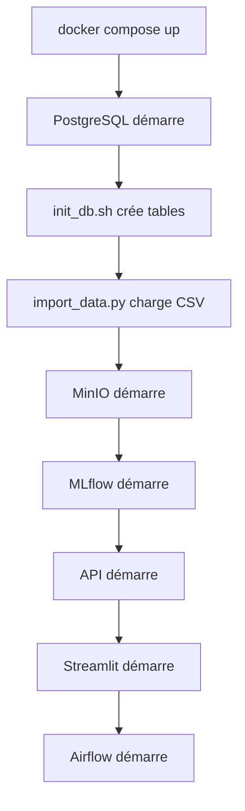
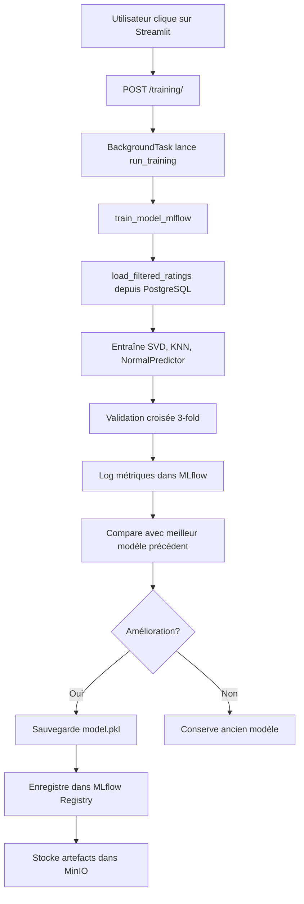
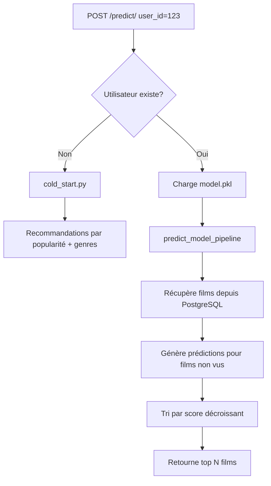
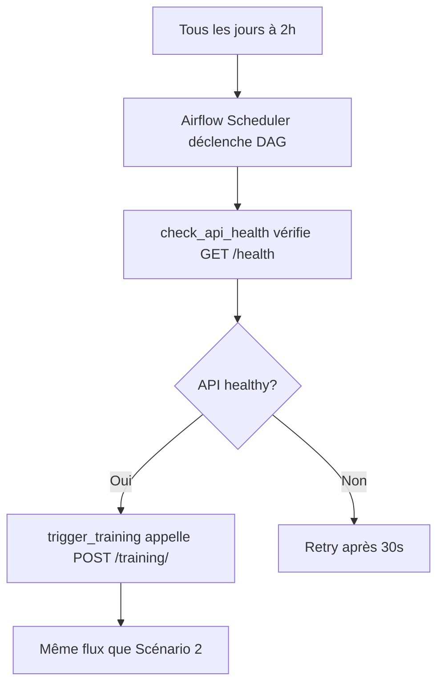

# Architecture de l'Application MLOps - Recommandation de Films

## Vue d'ensemble

Cette application est un système complet de recommandation de films utilisant les pratiques MLOps. Elle combine plusieurs technologies pour créer un pipeline automatisé d'entraînement, de déploiement et de monitoring de modèles de machine learning.

---

## 🚀 Flux de Démarrage (Ordre d'Exécution)

### 1. **Initialisation Docker** (`docker-compose.yml`)

Lorsque vous exécutez `docker compose up`, les services démarrent dans cet ordre :

#### **Étape 1.1 : Base de données PostgreSQL** (`db`)
- **Image** : `postgres:16-alpine`
- **Rôle** : Stocke toutes les données (films, utilisateurs, évaluations, tags)
- **Healthcheck** : Vérifie que PostgreSQL est prêt avec `pg_isready`
- **Volumes** : 
  - `pg_data` : Données persistantes
  - `./src/data/sql` : Scripts SQL montés

#### **Étape 1.2 : Initialisation de la base** (`init_db`)
- **Script** : [`src/data/sql/init_init_db.sh`](file:///c:/Users/Rom/jun25_bmle_mlops_reco_films/src/data/sql/init_init_db.sh)
- **Dépendances** : Attend que `db` soit healthy
- **Actions** :
  1. Crée l'utilisateur et la base `airflow` pour Apache Airflow
  2. Accorde les permissions nécessaires
  3. Exécute [`create_table.sql`](file:///c:/Users/Rom/jun25_bmle_mlops_reco_films/src/data/sql/create_table.sql) pour créer les tables :
     - `users`, `movies`, `ratings`, `tags`, `genres`
     - `movie_genres`, `movie_tags`, `links`
     - `genome_tags`, `genome_scores`

#### **Étape 1.3 : Import des données** (`import_data`)
- **Script** : [`docker/import_data/init_import_data.sh`](file:///c:/Users/Rom/jun25_bmle_mlops_reco_films/docker/import_data/init_import_data.sh)
- **Dépendances** : Attend `db` et `init_db`
- **Processus** :
  1. Vérifie si la base est déjà remplie avec [`check_db.py`](file:///c:/Users/Rom/jun25_bmle_mlops_reco_films/src/data/sql/check_db.py)
  2. Si vide, lance [`import_data.py`](file:///c:/Users/Rom/jun25_bmle_mlops_reco_films/src/data/sql/import_data.py) qui :
     - Lit les fichiers CSV du dataset MovieLens 20M
     - Importe ~20 millions d'évaluations par chunks (50 000 lignes)
     - Importe films, utilisateurs, tags, genres, etc.
     - Prend environ 25 minutes

#### **Étape 1.4 : MinIO** (`minio`)
- **Rôle** : Stockage S3-compatible pour les artefacts MLflow et DVC
- **Ports** : 9000 (API), 9001 (Console web)
- **Healthcheck** : Vérifie l'endpoint `/minio/health/ready`

#### **Étape 1.5 : MLflow** (`mlflow`)
- **Dépendances** : Attend que MinIO soit healthy
- **Rôle** : Tracking des expériences ML, gestion des modèles
- **Configuration** :
  - Backend store : SQLite local (`/mlflow`)
  - Artifact store : MinIO (S3)
- **Port** : 5000

#### **Étape 1.6 : API FastAPI** (`api`)
- **Dépendances** : Attend `db` et `mlflow`
- **Rôle** : API REST pour les prédictions, l'entraînement et le monitoring
- **Port** : 8080 (mappé sur 8000 interne)

#### **Étape 1.7 : Services de monitoring**
- **Prometheus** : Collecte les métriques (port 9090)
- **Grafana** : Visualisation des métriques (port 3001)

#### **Étape 1.8 : Interface utilisateur**
- **Streamlit** : Interface web pour tester les recommandations (port 8501)

#### **Étape 1.9 : Orchestration**
- **Airflow Webserver** : Interface web d'Airflow (port 8081)
- **Airflow Scheduler** : Planification des DAGs

---

## 📊 Architecture des Composants

### **1. API FastAPI** (`src/api/`)

#### Point d'entrée : [`src/api/main.py`](file:///c:/Users/Rom/jun25_bmle_mlops_reco_films/src/api/main.py)
- Importe simplement `app` depuis `api.app`

#### Application principale : [`src/api/app.py`](file:///c:/Users/Rom/jun25_bmle_mlops_reco_films/src/api/app.py)
- **Middleware CORS** : Permet les requêtes cross-origin
- **Middleware Prometheus** : Enregistre les métriques de chaque requête
- **Routers** : Inclut 4 routers pour organiser les endpoints

#### Endpoints organisés par router :

##### **A. Training Router** ([`src/api/endpoints/training.py`](file:///c:/Users/Rom/jun25_bmle_mlops_reco_films/src/api/endpoints/training.py))
- `POST /training/` : Déclenche l'entraînement en arrière-plan
  - Appelle [`train_model_mlflow()`](file:///c:/Users/Rom/jun25_bmle_mlops_reco_films/src/pipeline/train_model_pipeline.py)
  - Utilise `BackgroundTasks` pour ne pas bloquer
- `GET /training/status` : Retourne le statut de l'entraînement
  - Vérifie `training_status` global
  - Récupère les métriques depuis MLflow

##### **B. Predict Router** ([`src/api/endpoints/predict.py`](file:///c:/Users/Rom/jun25_bmle_mlops_reco_films/src/api/endpoints/predict.py))
- `POST /predict/` : Génère des recommandations
  - Charge le modèle depuis `models/model.pkl`
  - Gère le **cold start** pour nouveaux utilisateurs
  - Appelle [`predict_model_pipeline.py`](file:///c:/Users/Rom/jun25_bmle_mlops_reco_films/src/pipeline/predict_model_pipeline.py)

##### **C. Data Router** ([`src/api/endpoints/data.py`](file:///c:/Users/Rom/jun25_bmle_mlops_reco_films/src/api/endpoints/data.py))
- `POST /generate-ratings/` : Génère des évaluations aléatoires
- `GET /get-random-ratings/` : Récupère des évaluations aléatoires
- `GET /stats` : Statistiques sur les données

##### **D. Monitoring Router** ([`src/api/endpoints/monitoring.py`](file:///c:/Users/Rom/jun25_bmle_mlops_reco_films/src/api/endpoints/monitoring.py))
- `GET /monitoring/drift` : Détecte le data drift
- `GET /monitoring/drift/evidently` : Rapport Evidently
- `POST /monitoring/drift/baseline` : Crée une baseline
- `GET /monitoring/stats` : Statistiques de monitoring

#### Modules de support :

- [`database.py`](file:///c:/Users/Rom/jun25_bmle_mlops_reco_films/src/api/database.py) : Connexion PostgreSQL
- [`schemas.py`](file:///c:/Users/Rom/jun25_bmle_mlops_reco_films/src/api/schemas.py) : Modèles Pydantic
- [`cold_start.py`](file:///c:/Users/Rom/jun25_bmle_mlops_reco_films/src/api/cold_start.py) : Gestion des nouveaux utilisateurs
- [`data_drift.py`](file:///c:/Users/Rom/jun25_bmle_mlops_reco_films/src/api/data_drift.py) : Détection de drift
- [`evidently_drift.py`](file:///c:/Users/Rom/jun25_bmle_mlops_reco_films/src/api/evidently_drift.py) : Rapports Evidently
- [`monitoring.py`](file:///c:/Users/Rom/jun25_bmle_mlops_reco_films/src/api/monitoring.py) : Métriques de qualité
- [`prometheus_metrics.py`](file:///c:/Users/Rom/jun25_bmle_mlops_reco_films/src/api/prometheus_metrics.py) : Métriques Prometheus

---

### **2. Pipeline d'Entraînement** (`src/pipeline/`)

#### Configuration : [`config.yaml`](file:///c:/Users/Rom/jun25_bmle_mlops_reco_films/src/pipeline/config.yaml)
- Chemins des modèles, données, métriques
- Configuration MLflow
- Paramètres du modèle

#### Chargement des données : [`data_loader.py`](file:///c:/Users/Rom/jun25_bmle_mlops_reco_films/src/pipeline/data_loader.py)
- `load_filtered_ratings()` : Charge les évaluations depuis PostgreSQL
- Filtre les utilisateurs/films avec peu d'évaluations

#### Entraînement : [`train_model_pipeline.py`](file:///c:/Users/Rom/jun25_bmle_mlops_reco_films/src/pipeline/train_model_pipeline.py)

**Flux d'exécution** :

1. **Connexion MLflow** : Configure le tracking URI et l'expérience
2. **Chargement des données** : Appelle `load_filtered_ratings()`
3. **Échantillonnage** : Crée des échantillons pour la validation croisée
4. **Entraînement de 3 modèles** :
   - **SVD** (Singular Value Decomposition)
   - **KNNBasic** (K-Nearest Neighbors)
   - **NormalPredictor** (baseline aléatoire)
5. **Validation croisée** : 3-fold CV pour chaque modèle
6. **Logging MLflow** : Enregistre paramètres et métriques (RMSE, MAE)
7. **Sélection du meilleur modèle** : Compare les RMSE
8. **Comparaison avec modèle précédent** :
   - Recherche le meilleur run précédent
   - Ne remplace que si amélioration ou si `force=True`
9. **Entraînement final** : Sur un échantillon plus large
10. **Sauvegarde** :
    - Fichier local : `models/model.pkl`
    - Artefact MLflow : Stocké dans MinIO
    - Modèle enregistré : `Best_Film_Recommender`

#### Prédiction : [`predict_model_pipeline.py`](file:///c:/Users/Rom/jun25_bmle_mlops_reco_films/src/pipeline/predict_model_pipeline.py)

**Flux d'exécution** :

1. **Chargement du modèle** : Depuis `models/model.pkl`
2. **Récupération des films** : Depuis PostgreSQL
3. **Génération des prédictions** : Pour tous les films non vus
4. **Tri et filtrage** : Top N recommandations
5. **Sauvegarde** : Dans `predictions/predictions.csv`

---

### **3. Interface Streamlit** (`src/`)

#### Application principale : [`streamlit_app.py`](file:///c:/Users/Rom/jun25_bmle_mlops_reco_films/src/streamlit_app.py)
- Page d'accueil avec statut du système
- Vérifie la connexion API via `/health`

#### Pages : (`src/pages/`)
- **Prédiction** : Interface pour obtenir des recommandations
- **Entraînement** : Lancer et suivre l'entraînement
- **Monitoring** : Visualiser les métriques et le drift

#### Utilitaires : [`api_utils.py`](file:///c:/Users/Rom/jun25_bmle_mlops_reco_films/src/api_utils.py)
- `api_request()` : Fonction helper pour appeler l'API

---

### **4. Orchestration Airflow** (`dags/`)

#### DAG : [`training_dag.py`](file:///c:/Users/Rom/jun25_bmle_mlops_reco_films/dags/training_dag.py)

**Configuration** :
- **Nom** : `movie_reco_training_pipeline`
- **Schedule** : `0 2 * * *` (tous les jours à 2h du matin)
- **Tags** : `mlops`, `reco`

**Tâches** :
1. `check_api_health` : Vérifie que l'API est disponible (`GET /health`)
2. `generate_new_data` : Génère de nouvelles données (`POST /generate-ratings`)
3. `trigger_training` : Appelle `POST /training/` avec `force=True`

**Dépendances** : `check_api_health >> generate_new_data >> trigger_training`

---

## 🔄 Flux de Données Complet

### **Scénario 1 : Premier démarrage**



### **Scénario 2 : Entraînement manuel**



### **Scénario 3 : Prédiction**



### **Scénario 4 : Entraînement automatique (Airflow)**



---

## 📁 Structure des Fichiers Clés

### **Fichiers de configuration**

| Fichier | Rôle |
|---------|------|
| [`docker-compose.yml`](file:///c:/Users/Rom/jun25_bmle_mlops_reco_films/docker-compose.yml) | Orchestration de tous les services |
| [`src/pipeline/config.yaml`](file:///c:/Users/Rom/jun25_bmle_mlops_reco_films/src/pipeline/config.yaml) | Configuration du pipeline ML |
| [`dvc.yaml`](file:///c:/Users/Rom/jun25_bmle_mlops_reco_films/dvc.yaml) | Pipeline DVC (non utilisé en production) |
| [`requirements.txt`](file:///c:/Users/Rom/jun25_bmle_mlops_reco_films/requirements.txt) | Dépendances Python |

### **Scripts d'initialisation**

| Fichier | Exécution | Rôle |
|---------|-----------|------|
| [`src/data/sql/init_init_db.sh`](file:///c:/Users/Rom/jun25_bmle_mlops_reco_films/src/data/sql/init_init_db.sh) | Au démarrage | Crée utilisateurs et bases de données |
| [`src/data/sql/create_table.sql`](file:///c:/Users/Rom/jun25_bmle_mlops_reco_films/src/data/sql/create_table.sql) | Après init_db | Crée le schéma de la base |
| [`docker/import_data/init_import_data.sh`](file:///c:/Users/Rom/jun25_bmle_mlops_reco_films/docker/import_data/init_import_data.sh) | Après init_db | Lance l'import si nécessaire |
| [`src/data/sql/import_data.py`](file:///c:/Users/Rom/jun25_bmle_mlops_reco_films/src/data/sql/import_data.py) | Si base vide | Importe les 20M d'évaluations |

### **Code métier**

| Fichier | Rôle |
|---------|------|
| [`src/api/app.py`](file:///c:/Users/Rom/jun25_bmle_mlops_reco_films/src/api/app.py) | Application FastAPI principale |
| [`src/pipeline/train_model_pipeline.py`](file:///c:/Users/Rom/jun25_bmle_mlops_reco_films/src/pipeline/train_model_pipeline.py) | Entraînement avec MLflow |
| [`src/pipeline/predict_model_pipeline.py`](file:///c:/Users/Rom/jun25_bmle_mlops_reco_films/src/pipeline/predict_model_pipeline.py) | Génération de prédictions |
| [`src/api/cold_start.py`](file:///c:/Users/Rom/jun25_bmle_mlops_reco_films/src/api/cold_start.py) | Gestion nouveaux utilisateurs |
| [`dags/training_dag.py`](file:///c:/Users/Rom/jun25_bmle_mlops_reco_films/dags/training_dag.py) | DAG Airflow quotidien |

---

## 🔍 Monitoring et Observabilité

### **Prometheus** ([`docker/prometheus/prometheus.yml`](file:///c:/Users/Rom/jun25_bmle_mlops_reco_films/docker/prometheus/prometheus.yml))
- Scrape l'endpoint `/metrics` de l'API toutes les 15s
- Métriques collectées :
  - `api_requests_total` : Nombre de requêtes par endpoint
  - `api_request_duration_seconds` : Latence des requêtes
  - `training_runs_total` : Nombre d'entraînements
  - Métriques custom de qualité des recommandations

### **Grafana**
- Dashboards pré-configurés dans `docker/grafana/`
- Visualise les métriques Prometheus
- Accès : http://localhost:3001 (admin/admin)

### **Evidently**
- Génère des rapports HTML de data drift
- Compare distribution actuelle vs baseline
- Détecte les changements dans les features

---

## 🎯 Points d'Entrée Utilisateur

### **1. Via Streamlit** (Recommandé pour utilisateurs)
- **URL** : http://localhost:8501
- **Fonctionnalités** :
  - Obtenir des recommandations pour un utilisateur
  - Lancer un entraînement
  - Visualiser les métriques de monitoring

### **2. Via API** (Pour développeurs/intégrations)
- **URL** : http://localhost:8080
- **Documentation** : http://localhost:8080/docs
- **Exemples** :
  ```bash
  # Obtenir des recommandations
  curl -X POST http://localhost:8080/predict/ \
    -H "Content-Type: application/json" \
    -d '{"user_id": 1, "n_recommendations": 10}'
  
  # Lancer un entraînement
  curl -X POST http://localhost:8080/training/ \
    -H "Content-Type: application/json" \
    -d '{"force": true}'
  ```

### **3. Via Airflow** (Automatisation)
- **URL** : http://localhost:8081
- **Credentials** : admin/admin
- **DAG** : `movie_reco_training_pipeline`
- **Schedule** : Quotidien à 2h du matin

### **4. Via MLflow** (Suivi des expériences)
- **URL** : http://localhost:5000
- **Fonctionnalités** :
  - Comparer les runs d'entraînement
  - Visualiser les métriques (RMSE, MAE)
  - Télécharger les modèles

---

## 🔐 Variables d'Environnement Importantes

### **API**
- `MLFLOW_TRACKING_URI=http://mlflow:5000`
- `MLFLOW_S3_ENDPOINT_URL=http://minio:9000`
- `DB_HOST=db`, `DB_NAME=reco_films`
- `AWS_ACCESS_KEY_ID=minioadmin`

### **MLflow**
- `AWS_ACCESS_KEY_ID=minioadmin`
- `AWS_SECRET_ACCESS_KEY=minioadmin123`
- `MLFLOW_S3_ENDPOINT_URL=http://minio:9000`

### **Airflow**
- `AIRFLOW__DATABASE__SQL_ALCHEMY_CONN=postgresql+psycopg2://airflow:airflow@db/airflow`
- `AIRFLOW_CONN_API_CONNECTION=http://api:8000`

---

## 📝 Résumé du Flux de Vie d'une Recommandation

1. **Données** : CSV → PostgreSQL (via `import_data.py`)
2. **Entraînement** : PostgreSQL → `train_model_pipeline.py` → MLflow → MinIO
3. **Modèle** : MLflow → `models/model.pkl` (local)
4. **Prédiction** : `model.pkl` + PostgreSQL → `predict_model_pipeline.py` → API
5. **Interface** : Streamlit → API → Utilisateur
6. **Monitoring** : API → Prometheus → Grafana
7. **Orchestration** : Airflow → API → Entraînement quotidien
