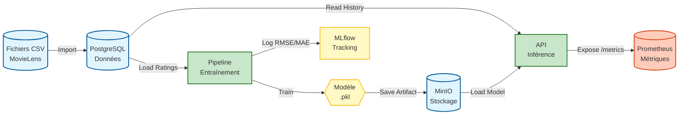
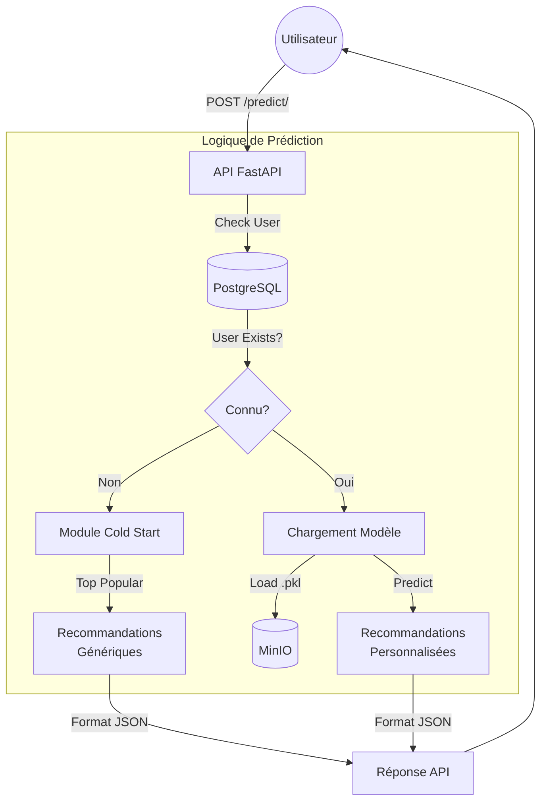
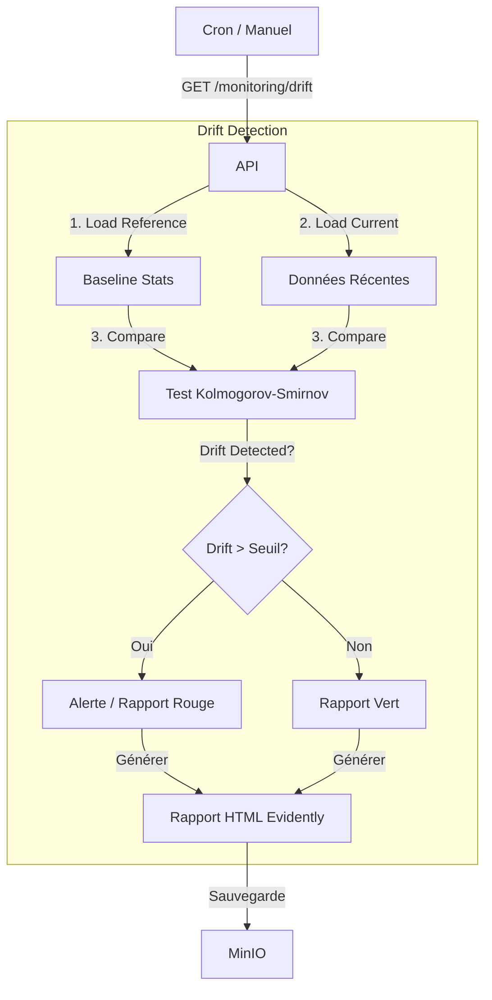

# Diagrammes de Flux

Ce document détaille les différents flux de données et de processus au sein de l'application MLOps.

## 1. 🔄 Flux de Données Global & Métriques

Ce diagramme illustre le cycle de vie complet de la donnée : de l'import initial jusqu'au monitoring, en passant par l'entraînement et l'inférence.



---

## 2. 🚀 Flux d'Entraînement (Training Pipeline)

Détail du processus déclenché par Airflow ou manuellement.

```mermaid
graph TD
    Trigger[Déclencheur\n(Airflow / Manuel)] -->|POST /generate-ratings| Gen[Génération Données]
    Gen -->|POST /training/| API[API FastAPI]
    API -->|Background Task| Pipeline[Pipeline d'Entraînement]
    
    subgraph "Logique d'Entraînement"
        Pipeline -->|1. Load| DB[(PostgreSQL)]
        DB -->|Données Filtrées| Split[Train/Test Split]
        Split -->|2. Train| Models[Entraînement Parallèle\n(SVD, KNN, Baseline)]
        Models -->|3. Evaluate| CV[Cross-Validation 3-fold]
        CV -->|4. Log| MLflow[MLflow Tracking]
        
        MLflow -->|Comparaison| Best{Meilleur que\nProduction?}
        Best -->|Oui| Save[Sauvegarde Modèle]
        Best -->|Non| Discard[Ignorer]
        
        Save -->|Upload| MinIO[(MinIO)]
        Save -->|Register| Registry[MLflow Model Registry]
    end
```

---

## 3. 🎯 Flux de Prédiction (Inférence)

Cheminement d'une requête utilisateur pour obtenir des recommandations.



---

## 4. 📊 Flux de Monitoring

Collecte et visualisation des métriques de santé et de performance.

```mermaid
graph LR
    subgraph "Application"
        API[API FastAPI] -->|Middleware| Metrics[Compteurs Prometheus]
        Metrics -->|Expose| Endpoint[/metrics]
    end
    
    subgraph "Observabilité"
        Prometheus[Prometheus] -->|Scrape 15s| Endpoint
        Grafana[Grafana] -->|Query PromQL| Prometheus
        User((Admin)) -->|View Dashboards| Grafana
    end
```

---

## 5. 📉 Flux de Détection de Drift

Analyse de la dérive des données (Data Drift).


